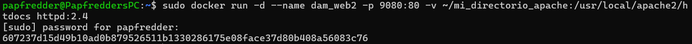
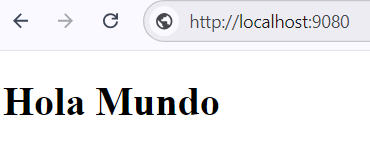
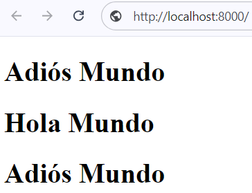
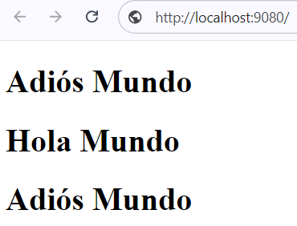

# Proyecto_Docker_02
Este proyecto va a tratar los diferentes usos y servicios que ofrece Apache a través de Docker, para ello seguiremos los diferentes apartados:

    1. Instalación
      1.1 Descarga de la imagen de Apache
      1.2 Creación de un nuevo contenedor llamado "dam_web1"

    2. Conexión con la web
      2.1 Acceso al contenedor desde el navegador
      2.2 Creación un "Hola Mundo" en HTML y accede desde el navegador
      2.3 Creación de un segundo contenedor "dam_web2" con puerto 9080
      2.4 Comprobación de los puertos con localhost
      2.5 Realización de modificaciones en la página web

# 1. Instalación

> [!NOTE]
> Este apartado tratará la instalación de la imagen "Apache" en Docker, junto a la creación de su respectivo contenedor.

## 1.1 Descarga de la imagen de Apache
Para descargar e instalar la imagen de Apache utilizamos los siguientes comandos:

**sudo docker pull httpd:2.4**

> [!IMPORTANT]
> Este comando se encarga de buscar la imagen de Apache en la base de datos de Docker

**sudo docker images**

> [!IMPORTANT]
> Este comando se encarga de mostrar todas las imágenes instaladas en Docker

Resultado:

## 1.2 Creación de un contenedor "dam_web1"
Para crear un contenedor con estas carácteristicas utilizamos el siguiente comando:

**sudo docker run -d --name dam_web1 httpd:2.4**

> [!IMPORTANT]
> Este comando se encarga de crear un contenedor llamado "dam_web1" de la imagen httpd:2.4

Resultado:

# 2. Conexión con la web

> [!NOTE]
> En este apartado trataremos las conexiones navegador - contenedor e implementaremos el uso de puertos locales

## 2.1 Acceso al contenedor desde un navegador
Para acceder al contenedor desde un navegador debemos utilizar los siguientes comandos:

**sudo mkdir -p ~/directorio_apache**

> [!IMPORTANT]
> Este comando se encarga de crear un directorio en la máquina que contendra el archivo "htdocs"

**sudo docker run -d --name dam_web1 -p 8000:80 -v ~/directorio_apache:/usr/local/apache2/htdocs httpd:2.4**

> [!IMPORTANT]
> Este comando se encarga de montar el archivo "htdocs" y de crear un contenedor que conecte el puerto 80 al puerto 8000 del host local

## 2.2 Creación de un "Hola mundo" 
Para crear un hola mundo en el directorio y mostrarlo desde el navegador debemos seguir los siguientes pasos:

Primero debemos crear un archivo HTML en /directorio_apache que contenga el hola mundo

Ahora entramos en **http://localhost:8000/** para ver el resultado de la página web

Resultado:

## 2.3 Creación del segundo contenedor
Al igual que hicimos antes, usamos el siguiente comando para crear un contenedor de port 9080 y port local 80:

**docker run -d --name dam_web2 -p 9080:80 -v ~/mi_directorio_apache:/usr/local/apache2/htdocs httpd:2.4**

> [!IMPORTANT]
> Este comando se encarga de crear un segundo contenedor con port 9080, para poder acceder a ambos

Resultado:

## 2.4 Comprobación de los local host
Podemos comprobar que ambos local host funcionen entrando en las rutas:

    **http://localhost:8000/**
    **http://localhost:9080/**

Como pusimos que ambas páginas web tengan el port local "80" las dos deben mostrar igual la página web ya que tienen el mismo index

Resultado:

## 2.5 Modificamos la página web
Esto se puede hacer solamente cambiando el index y volviendo a entrar en las rutas anteriores

Resultado:

